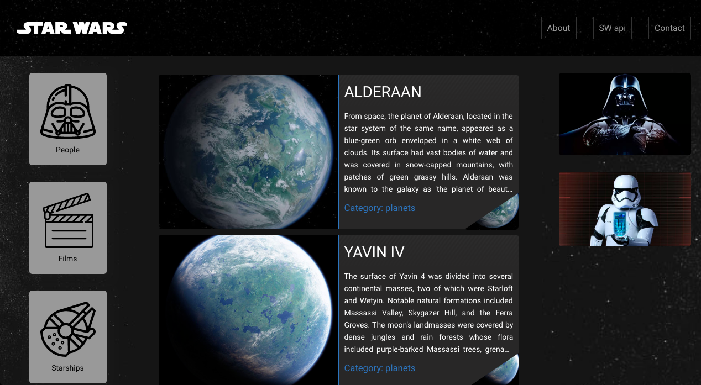
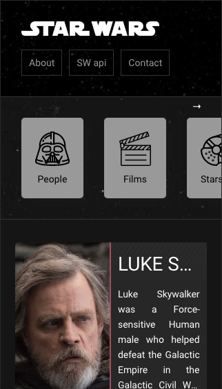

# Star Wars Info

  

  
  
  

  

  

Este repositório contém um projeto de buscas dentro da api do Star Wars
- Em conjunto com a api a interface é completamente funcional.

Tecnologias utilizadas:
* [ReactJS](https://reactjs.org/)
* [Yarn](https://yarnpkg.com/)

## Como executar
- Faça o clone/download deste repositório;
- Garanta que sua api no diretório de backend esteja rodando na porta 5000;
- Execute `yarn install` e `yarn start`. A interface fica localizada em `http://localhost:3000`.

## Recursos
Selecione os items a esquerda e faça buscas pelas categorias.
